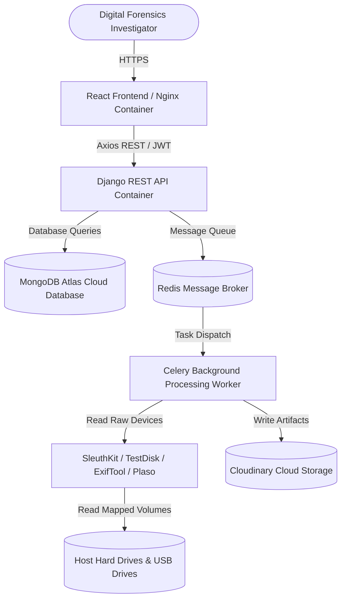
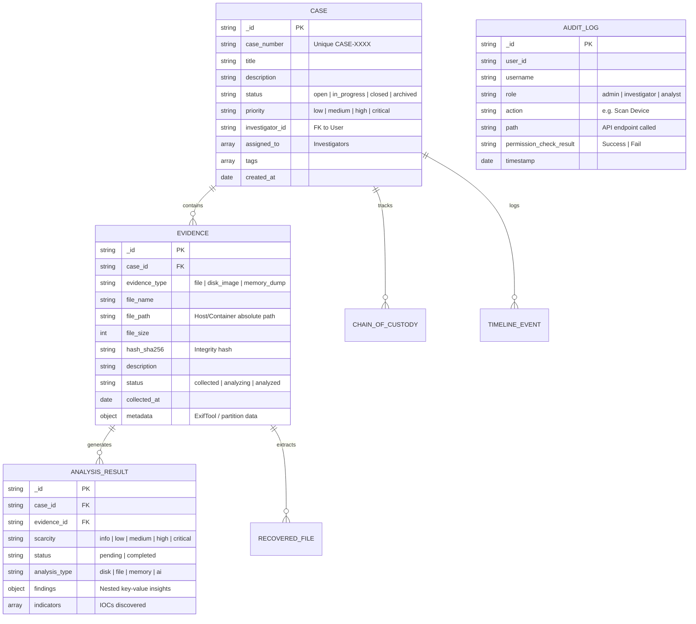

# AIDFIRS Deployment & Architecture Documentation Booklet

This documentation provides complete, production-ready instructions for deploying, developing, and troubleshooting the AI-Powered Digital Forensic Investigation and Recovery System (AIDFIRS).

---

## 1. System Architecture

The AIDFIRS platform is designed as a secure, sandboxed, high-performance web platform. It leverages containerization to bundle native command-line digital forensics utilities (The Sleuth Kit, TestDisk, PhotoRec, ExifTool, Plaso) directly into the backend container, eliminating client-side dependencies.

### Architecture Flow Diagram



---

## 2. Database Schema (MongoDB Atlas)

AIDFIRS uses MongoDB Atlas for case data, evidence lists, and analytical records due to the highly nested, semi-structured nature of digital forensic metadata (such as Exif tags, timeline events, and carved file properties).



---

## 3. Directory Layout Map

Below is the repository structure for the AIDFIRS platform:

```
ai-digital-forensics-system-complete/
│
├── docker-compose.yml              # Production/Dev container services orchestrator
├── Dockerfile                      # Unified backend container builder (Ubuntu + Forensic packages)
├── README.md                       # High-level project summary
├── start_frontend.py               # Local Vite start script (port 3000)
├── start_server.py                 # Local Django start script (port 8000)
│
├── backend/                        # Django REST Framework Backend
│   ├── manage.py                   # Django CLI administrative helper
│   ├── db_init.py                  # MongoDB Atlas collections and index builder
│   ├── requirements.txt            # Python dependencies manifest
│   ├── production.env.example      # Production credentials template
│   ├── development.env.example     # Local development configurations template
│   │
│   ├── backend/                    # Core project configurations
│   │   ├── settings.py             # Django settings (CORS, JWT, CSP, Exceptions)
│   │   ├── urls.py                 # Core routing registry
│   │   ├── exceptions.py           # Custom DRF exception interceptor & logger
│   │   └── celery.py               # Celery app initialization
│   │
│   ├── accounts/                   # Authentication & User Role app
│   ├── cases/                      # Case files, timelines, Chain of Custody app
│   ├── evidence/                   # Evidence parsing & tools coordinator app
│   ├── devices/                    # Drive diagnostics & diagnostics detection app
│   ├── analysis/                   # AI agent & findings classifier app
│   └── forensic_engine/            # Raw Python sector readers and script carvers
│
└── frontend/                       # React Web Client
    └── web/
        ├── package.json            # NPM dependencies manifest
        ├── tailwind.config.cjs     # Styling framework configs
        ├── vite.config.js          # Vite build manager
        ├── index.html              # Main HTML entry point
        ├── Dockerfile              # Frontend client builder (Vite + Nginx production stage)
        └── src/                    # Source files
            ├── api.js              # Axios centralized API client
            ├── App.jsx             # Router definition and route guards
            └── components/         # Page modules (TopBar, Sidebar, Devices, PermissionsAudit)
```

---

## 4. Local Development Guide

To run the application locally on a development host without containers:

### Prerequisites
* **Python 3.11** or higher.
* **Node.js v18** or higher.
* **MongoDB Community Server** (running locally on port 27017 or a MongoDB Atlas cluster URI).
* **Redis Server** (running locally on port 6379).

### Step 1: Clone and Configure Environment
1. Copy `backend/development.env.example` to `backend/.env` (and a copy to `.env` in the root).
2. Open `backend/.env` and update configuration variables (such as local MongoDB URI, Anthropic Claude keys, and Google client ID).
3. Create `frontend/web/.env` and configure:
   ```env
   VITE_GOOGLE_CLIENT_ID=your-google-oauth-client-id-here.googleusercontent.com
   ```

### Step 2: Initialize Backend virtualenv & Install Forensic Tools
On Windows (with powershell):
```powershell
# Create virtual environment
python -m venv venv
venv\Scripts\activate

# Install python requirements
pip install -r backend/requirements.txt
```
*(Make sure to download and install native command line utilities: Sleuth Kit, TestDisk/PhotoRec, and ExifTool, and add their directories to the system PATH environment variable).*

### Step 3: Run Database Init & Django Server
```powershell
# Setup MongoDB collections and indexes
python backend/db_init.py

# Run Django migrations for internal Django sqlite tables
python backend/manage.py migrate

# Run Django development server (starts on port 8000)
python start_server.py
```

### Step 4: Run React Frontend Client
```powershell
# From root directory, launch Vite server (starts on port 3000)
python start_frontend.py
```

---

## 5. Docker Guide

Docker is the recommended mechanism for deploying and running the entire platform in a single command, automatically loading pre-compiled native forensic utilities inside a sandboxed Linux environment.

### Production Run Commands
To build, configure, and start the application in the background:
```bash
# 1. Create a copy of production.env.example as .env in the root folder
cp backend/production.env.example .env

# 2. Start the services container
docker-compose up -d --build
```
* **Vite Web Client**: Available at `http://localhost:3000`.
* **Django API Gateway**: Available at `http://localhost:8000`.
* **Mongo Database**: Exposed at `http://localhost:27017` (stored in persistent volume `mongodb_data`).
* **Redis Cache Broker**: Exposed at `http://localhost:6379`.

### Useful Docker CLI Commands
```bash
# View running containers status
docker-compose ps

# Monitor logs from all services in real-time
docker-compose logs -f

# Stop the services preserving volumes
docker-compose down

# Stop the services and delete database volumes
docker-compose down -v

# Run database indexing inside the container
docker-compose exec backend python backend/db_init.py
```

### Mount Volumes for Raw Host Drives
To analyze connected USB drives or SSDs inside Docker on Windows/Mac, specify drive mount mappings inside `docker-compose.yml` volumes:
```yaml
    volumes:
      - /mnt:/mnt:ro          # Maps WSL /mnt/ (where Windows drives reside) inside Docker
      - /run/desktop/mnt/host:/host:ro # Maps direct Docker host volumes
```

---

## 6. Production Deployment Guide (AWS / DigitalOcean)

For a secure, public deployment, follow this roadmap.

### 1. Provision Server Instance & Setup Docker
Create an Ubuntu Linux VM (AWS EC2 t3.medium or DigitalOcean Droplet 4GB RAM / 2 vCPUs recommended to support disk parsing operations).
```bash
# Update server
sudo apt-get update && sudo apt-get upgrade -y

# Install Docker & Docker Compose
sudo apt-get install -y docker.io docker-compose
sudo systemctl enable docker && sudo systemctl start docker
```

### 2. Configure Domain Name & SSL Certificates (Nginx Reverse Proxy)
Deploy an Nginx instance on the host to forward public HTTPS requests to the Docker network.
```bash
# Install Certbot & Nginx
sudo apt-get install -y nginx certbot python3-certbot-nginx

# Obtain SSL Certificate
sudo certbot --nginx -d aidfirs.yourdomain.com
```

#### Production Nginx Server Block (/etc/nginx/sites-available/aidfirs)
```nginx
server {
    listen 80;
    server_name aidfirs.yourdomain.com;
    return 301 https://$host$request_uri;
}

server {
    listen 443 ssl;
    server_name aidfirs.yourdomain.com;

    ssl_certificate /etc/letsencrypt/live/aidfirs.yourdomain.com/fullchain.pem;
    ssl_certificate_key /etc/letsencrypt/live/aidfirs.yourdomain.com/privkey.pem;

    location / {
        proxy_pass http://localhost:3000; # Routes to Frontend Nginx stage
        proxy_set_header Host $host;
        proxy_set_header X-Real-IP $remote_addr;
        proxy_set_header X-Forwarded-For $proxy_add_x_forwarded_for;
        proxy_set_header X-Forwarded-Proto $scheme;
    }

    location /api/ {
        proxy_pass http://localhost:8000; # Routes to Django REST API
        proxy_set_header Host $host;
        proxy_set_header X-Real-IP $remote_addr;
        proxy_set_header X-Forwarded-For $proxy_add_x_forwarded_for;
        proxy_set_header X-Forwarded-Proto $scheme;
    }
}
```

### 3. Continuous Deployment (CI/CD) via GitHub Actions
Create `.github/workflows/deploy.yml` to build and redeploy automatically on push to the `main` branch.
```yaml
name: Deploy AIDFIRS Platform

on:
  push:
    branches: [ main ]

jobs:
  deploy:
    runs-on: ubuntu-latest
    steps:
      - name: Deploy to Server via SSH
        uses: appleboy/ssh-action@master
        with:
          host: ${{ secrets.SSH_HOST }}
          username: ${{ secrets.SSH_USER }}
          key: ${{ secrets.SSH_PRIVATE_KEY }}
          script: |
            cd /var/www/ai-digital-forensics-system-complete
            git pull origin main
            docker-compose up -d --build
            docker-compose exec -T backend python backend/db_init.py
            docker-compose exec -T backend python backend/manage.py migrate
```

---

## 7. API Reference Spec

All requests must carry a valid JSON Web Token (`JWT`) in the header (except public login/register endpoints):
`Authorization: Bearer <access_token>`

| Category | Endpoint | Method | Params | Description |
| :--- | :--- | :--- | :--- | :--- |
| **Auth** | `/api/accounts/register/` | POST | payload | User registration (Awaiting Admin Activation) |
| **Auth** | `/api/accounts/login/` | POST | payload | User authentication (Traditional credentials) |
| **Auth** | `/api/accounts/oauth/google/` | POST | payload | Exchange Google OAuth code for DRF JWT token |
| **Cases** | `/api/cases/` | GET | - | List cases (Assigned list only for analysts) |
| **Cases** | `/api/cases/search/` | GET | `q=query` | Global search cases, evidence, analysis findings |
| **Cases** | `/api/cases/:id/timeline/` | GET | `search=val` | Timeline event logs list and filter |
| **Evidence** | `/api/evidence/` | POST | payload | Upload or map raw device paths |
| **Evidence** | `/api/evidence/:id/recover-and-analyze/` | POST | - | SSE Streaming pipeline for raw files & metadata carving |
| **Devices** | `/api/devices/diagnostics/` | POST | payload | Diagnostics verification check (Docker, Read, Compatibility) |
| **Audit Logs**| `/api/accounts/audit-logs/` | GET | `limit=int` | Retrieve access denial audit trail logs (Admin only) |

---

## 8. Troubleshooting Guide

### 1. Google OAuth Mismatch Error
* **Symptom**: `redirect_uri_mismatch` error page on Google consent page.
* **Resolution**: Confirm your Redirect URI in the Google Cloud Console is exactly matching the frontend origin address followed by the callback route (e.g. `http://localhost:3000/oauth/callback/google` or `https://aidfirs.yourdomain.com/oauth/callback/google`).

### 2. OSError: [Errno 22] Invalid Argument during Windows Raw Drive Reads
* **Symptom**: Crashes or fails on Windows raw disk reads (e.g. `\\.\D:`).
* **Resolution**: The raw disk parser requires 512-byte sector-aligned reads and seeks. Ensure that all raw reads are executed through the `SectorAlignedFile` class wrapper inside `backend/forensic_engine/file_carver.py`.

### 3. Docker Device Permissions Denied
* **Symptom**: The containerized backend fails to access raw drives with `Permission denied`.
* **Resolution**: Run the container with elevated privileges. Under Linux/WSL, add `privileged: true` or `--privileged` flag in the Docker service configuration. Ensure the host drive is mounted under WSL via `sudo mount -t drvfs D: /mnt/d`.

### 4. CSRF Validation Failed (Forbidden 403)
* **Symptom**: API endpoints return 403 Forbidden with CSRF validation errors.
* **Resolution**: Ensure the frontend host origin is listed in the `CSRF_TRUSTED_ORIGINS` settings array inside `settings.py`. For custom Axios requests, verify headers include the `X-CSRFToken` cookie value.
